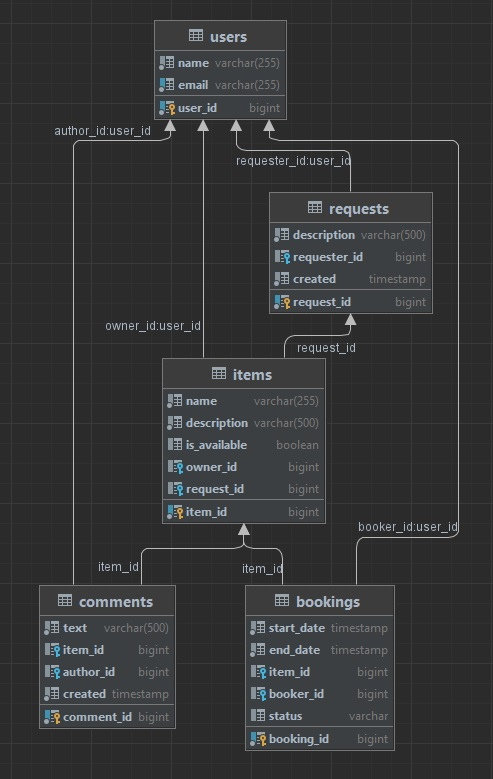

# java-shareit
Template repository for Shareit project.

### **_Бэкенд для сервиса шеринга (от англ. share — «делиться») вещей._**

# Спринт №13

### **_Реализация модели данных_**

Cтруктура по фичам — весь код для работы с определённой сущностью в одном пакете. 
Всего четыре пакета — item, booking, request и user. 
В каждом из этих пакетов свои контроллеры, сервисы, репозитории.

### **_Создание DTO-объектов и мапперов_**

Разделение объектов, которые хранятся в базе данных и которые возвращаются пользователям. 
Для реализация отдельная версия каждого класса, с которой будут работать пользователи 
— DTO (Data Transfer Object).
Mapper-классы — помогают преобразовывать объекты модели в DTO-объекты и обратно.

### **_Разработка контроллеров_**

Основные сценарии, которые поддерживает приложение:
* Добавление новой вещи. Происходит по эндпойнту POST /items. На вход поступает объект ItemDto. 
userId в заголовке X-Sharer-User-Id — это идентификатор пользователя, который добавляет вещь. 
Именно этот пользователь — владелец вещи. Идентификатор владельца поступает на вход в каждом из 
запросов, рассмотренных далее.
* Редактирование вещи. Эндпойнт PATCH /items/{itemId}. Изменить можно название, описание и статус 
доступа к аренде. Редактировать вещь может только её владелец.
* Просмотр информации о конкретной вещи по её идентификатору. Эндпойнт GET /items/{itemId}. 
Информацию о вещи может просмотреть любой пользователь.
* Просмотр владельцем списка всех его вещей с указанием названия и описания для каждой. 
Эндпойнт GET /items.
* Поиск вещи потенциальным арендатором. Пользователь передаёт в строке запроса текст, 
и система ищет вещи, содержащие этот текст в названии или описании. 
Происходит по эндпойнту /items/search?text={text}, в text передаётся текст для поиска.

# Спринт №14

### **_Создание базы данных_**

В ней по одной таблице для каждой из основных сущностей, а также таблица, где хранятся отзывы.
SQL-код для создания всех таблиц хранится в файле resources/schema.sql — Spring Boot выполняет 
содержащийся в нём скрипт на старте проекта, все конструкции в этом файле поддерживают 
множественное выполнение. 

### **_Реализация функции бронирования_**

Основные сценарии, которые поддерживает приложение:
* Добавление нового запроса на бронирование. Запрос может быть создан любым пользователем, 
а затем подтверждён владельцем вещи. Эндпоинт — POST /bookings. 
После создания запрос находится в статусе WAITING — «ожидает подтверждения».
* Подтверждение или отклонение запроса на бронирование. Может быть выполнено только владельцем вещи. 
Затем статус бронирования становится либо APPROVED, либо REJECTED. 
Эндпоинт — PATCH /bookings/{bookingId}?approved={approved}, 
параметр approved может принимать значения true или false.
* Получение данных о конкретном бронировании (включая его статус). 
Может быть выполнено либо автором бронирования, либо владельцем вещи, 
к которой относится бронирование. Эндпоинт — GET /bookings/{bookingId}.
* Получение списка всех бронирований текущего пользователя. 
Эндпоинт — GET /bookings?state={state}. Параметр state необязательный и 
по умолчанию равен ALL (англ. «все»). Также он может принимать значения 
CURRENT (англ. «текущие»), PAST (англ. «завершённые»), FUTURE (англ. «будущие»), 
WAITING (англ. «ожидающие подтверждения»), REJECTED (англ. «отклонённые»). 
Бронирования должны возвращаться отсортированными по дате от более новых к более старым.
* Получение списка бронирований для всех вещей текущего пользователя. 
Эндпоинт — GET /bookings/owner?state={state}. Этот запрос имеет смысл для владельца 
хотя бы одной вещи. Работа параметра state аналогична его работе в предыдущем сценарии.

### **_Добавление отзывов_**

* Отзыв можно добавить по эндпоинту POST /items/{itemId}/comment.
* Отзывы можно увидеть по двум эндпоинтам — по GET /items/{itemId} 
для одной конкретной вещи и по GET /items для всех вещей данного пользователя. 